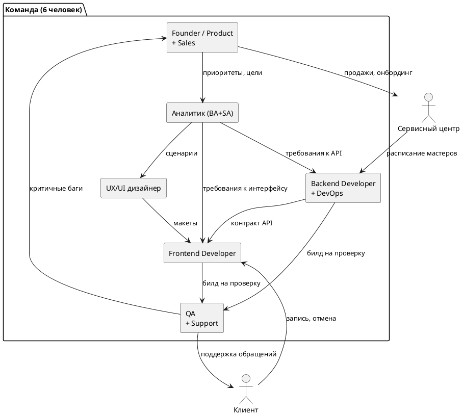
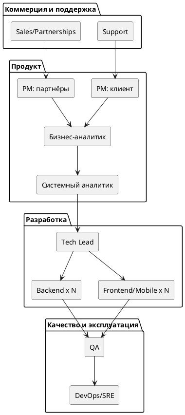

# Домашнее задание: роли и позиции в команде

**Ситуация:** небольшая компания создаёт цифровой сервис для записи клиентов в локальные сервисные центры. Старт — 6 человек, ожидается рост в течение года.

---

## 1. Деятельность, которую нужно закрыть

По модели жизненного цикла (исследование → планирование → проектирование → разработка → тестирование → эксплуатация) плюс сквозная бизнес-деятельность:

| Стадия | Деятельность в контексте сервиса записи |
|---|---|
| Исследование | Изучить, как сейчас происходит запись в сервисных центрах; поговорить с центрами и клиентами; проверить, готовы ли центры делиться расписанием |
| Планирование | Определить MVP: запись/отмена/перенос, напоминания. Отложить: онлайн-оплату, аналитику для центров |
| Проектирование | Спроектировать сценарии (конфликт слотов, отмена, no-show), архитектуру (клиентский виджет, админ-панель центра, backend с календарём) |
| Разработка | Backend (API, БД, уведомления), фронтенд/виджет записи, админ-панель для сервисного центра |
| Тестирование | Проверить сценарии записи и граничные случаи (два клиента бронируют один слот одновременно, часовые пояса) |
| Эксплуатация | Выкатить в пилотных центрах, мониторить, реагировать на инциденты |
| Сквозная (бизнес) | Продажи/онбординг сервисных центров-партнёров; поддержка первых пользователей |

---

## 2. Распределение на 6 позиций

| Позиция | Цель | Зона ответственности | Взаимодействие |
|---|---|---|---|
| **Founder / Product Manager** | Определить ценность и приоритеты; обеспечить приток партнёров | Продуктовая стратегия и roadmap, приоритизация MVP, продажи/партнёрства с сервисными центрами | С аналитиком — что и зачем делаем; с разработчиками/дизайнером — сроки и приоритеты; с сервисными центрами — переговоры и внедрение |
| **Аналитик (BA+SA)** | Превратить бизнес-потребность в понятные для разработки требования | Сбор требований, пользовательские сценарии (запись/отмена/перенос), нефункциональные ограничения | С Product — цели; с дизайнером — сценарии; с разработчиками — детализация задач; с QA — критерии проверки |
| **UX/UI дизайнер** | Сделать интерфейс понятным для двух разных аудиторий | Сценарии использования, макеты клиентского виджета и админ-панели центра | С аналитиком — исходные сценарии; с разработчиками — передача макетов; с Product — соответствие ценности |
| **Backend Developer (+ DevOps)** | Реализовать серверную логику записи и стабильную работу в проде | Backend/API, база данных, интеграции (SMS/push), деплой и мониторинг | С фронтендом — контракт API; с QA — баги; с аналитиком — уточнение логики |
| **Frontend/Mobile Developer** | Реализовать клиентские интерфейсы | Frontend/mobile-часть, интеграция с backend API | С дизайнером — реализация макетов; с backend — контракт API; с QA — проверка сценариев |
| **QA (+ Support)** | Убедиться, что сценарии работают корректно; быть первой линией связи с пользователями | Тестирование, приёмка перед релизом, обработка обращений пользователей | С разработчиками — баги и приёмка; с Product — приоритеты фиксов; с пользователями — обращения |

**Почему так, а не иначе:** при 6 людях нельзя закрыть отдельным человеком каждую активность из презентации (Manager, Аналитик, Developer, QA, DevOps, UX/UI — это уже 6 позиций из слайда про 10–12 человек). Поэтому DevOps и Support не выделены отдельно, а «пристёгнуты» к ролям, которые физически ближе всего к этой деятельности (Backend — к эксплуатации, QA — к разбору обращений), а не к случайным ролям (например, не «Дизайнер+DevOps» — между ними нет содержательной связи).

---

## 3. Совмещения и риски (минимум 2)

| Совмещение | Риск |
|---|---|
| Founder/Product + Sales/Partnerships | Продажи «продавливают» roadmap: обещания конкретным партнёрам постоянно перебивают продуктовую стратегию; при перегрузке или уходе этого человека компания одновременно теряет и продуктовое видение, и канал привлечения партнёров (bus factor) |
| Backend Developer + DevOps | В момент прод-инцидента разработка новых фич останавливается — один и тот же человек чинит прод и пишет код; эксплуатационные задачи (мониторинг, бэкапы, алерты) откладываются «на потом» до первого серьёзного сбоя |
| QA + Support | Разбор пользовательских обращений вытесняет регресс-тестирование перед релизом → баги чаще доезжают до прода → это порождает больше обращений — замкнутый круг |

---

## 4. Что изменится при росте до 20 человек

- **Совмещённые роли разделяются:** отдельный DevOps/SRE, отдельная функция поддержки, отдельная коммерческая роль (Sales/Partnerships) — Product Manager перестаёт продавать сам.
- **Аналитик делится на BA и SA:** бизнес-аналитик работает с сервисными центрами и требованиями, системный аналитик — со спецификациями для разработки.
- **Разработка специализируется:** вместо одного backend- и одного frontend-разработчика — несколько человек (например, отдельно интеграции с SMS/push, отдельно mobile), появляется Tech Lead, координирующий архитектуру.
- **QA делится** на ручное тестирование и автотесты/QA-инженерию.
- **Растут коммуникационные издержки:** то, что решалось «на словах» за одним столом, требует беклога, регулярных синков и письменных требований — иначе возникает ситуация «никто не отвечает» / «отвечают все».
- **Продукт может расщепиться на два потока:** сервис двусторонний (клиенты и сервисные центры-партнёры), поэтому вероятно разделение на Product для клиента и Product/интеграции для сервисных центров.

