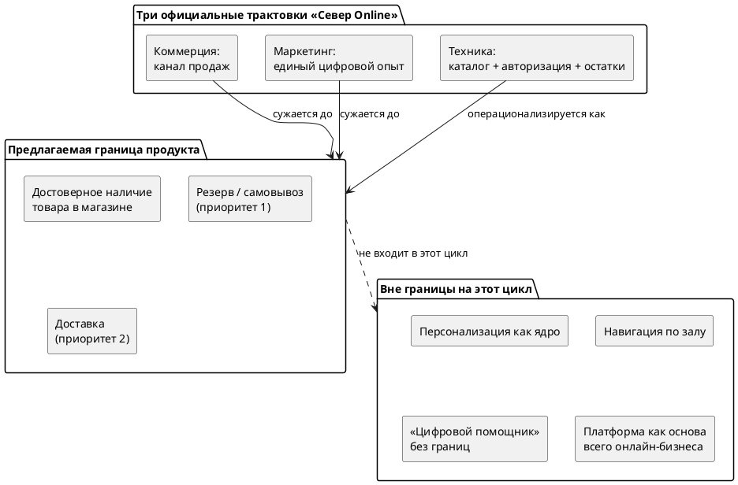
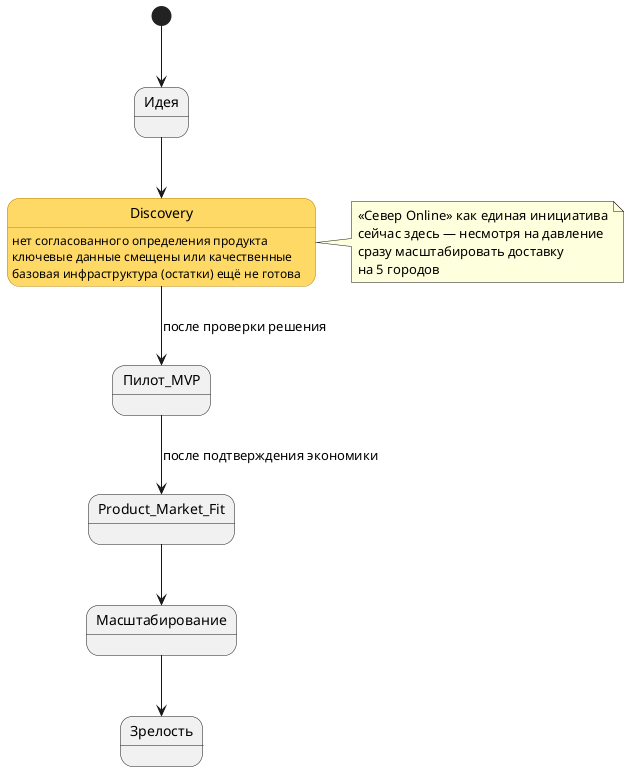
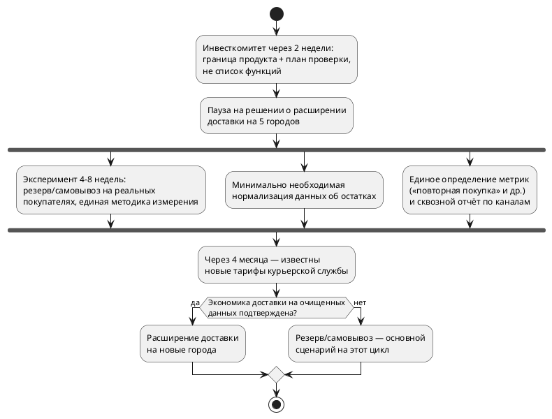

# Кейс «Что мы вообще создаём?»

### Продуктовый разбор инициативы «Север Online» (сеть «СеверМаркет»)

*Формат: эссе к инвестиционному комитету*

---

## Резюме

«СеверМаркет» выстроил вокруг розницы несколько цифровых сервисов — приложение, сайт, пилот доставки, — но так и не ответил на вопрос, что именно является продуктом инициативы «Север Online». Коммерческий блок называет её каналом продаж, маркетинг — единым цифровым опытом, техническая команда — платформой данных и сервисов. Это не три описания одного и того же продукта, а три разных продукта под одним названием, и именно это расхождение, а не нехватка ресурсов, сейчас определяет конфликт приоритетов.

Мы предлагаем считать продуктом не доставку и не «цифрового помощника от мысли до выхода из магазина», а более узкий и проверяемый слой: **достоверную уверенность в наличии конкретного товара в конкретном магазине и гибкий способ его получить**, где резерв/самовывоз — первый по приоритету сценарий, а доставка — второй, экономически ещё не подтверждённый. Инициатива в целом находится на стадии проверки проблемы и решения (discovery), а не масштабирования — несмотря на давление расширить доставку сразу на пять городов. Главная неопределённость — не в экономике доставки и не в поведении «смотрят сайт внутри магазина», а в том, какая потребность покупателя должна быть положена в основу продукта; от ответа на этот вопрос зависят все остальные решения. Следующий шаг, который мы предлагаем инвестиционному комитету, — не список функций, а короткий контролируемый эксперимент, который снимет эту неопределённость до того, как компания зафиксирует капитальные обязательства по расширению доставки.

---

## 1. Что мы считаем продуктом и почему граница разумна

В кейсе одновременно существуют три официальных определения «Север Online»:

| Блок | Определение продукта |
|---|---|
| Коммерческий блок | Новый канал продаж |
| Маркетинг | «Единое цифровое взаимодействие с покупателем до, во время и после посещения магазина» |
| Техническая команда | Каталог товаров, единая авторизация и сервис данных об остатках, поверх которых подключаются клиентские сценарии |

Все три формулировки описывают разный масштаб и разную единицу ценности, и именно поэтому «через несколько месяцев различия в понимании стали влиять на приоритеты» — это прямая цитата из кейса, а не наша интерпретация.

**Наша граница продукта:** «Север Online» — это слой достоверной информации о наличии товара в конкретном магазине и набор способов гибко его получить (в приоритете — резерв/самовывоз, во вторую очередь — доставка), построенный поверх минимально необходимых для этого данных (остатки, цена, авторизация). Персонализация, навигация по залу и роль «цифрового помощника» на всех этапах пути покупателя в границу на ближайшие полгода не входят.

Граница разумна по четырём причинам:

1. **Собирает независимые сигналы, а не один источник.** Потребность «узнать точно, есть ли товар, и получить его без лишней поездки» повторяется в четырёх независимых источниках: вопросы поддержки, интервью покупателей, поведение внутри магазина, жалоба технического руководителя на качество данных. Ни доставка, ни «частота взаимодействия» маркетинга не имеют такой конвергенции.
2. **Проверяема за шесть месяцев** — в отличие от «платформы как основы бизнеса» или безграничного «цифрового помощника».
3. **Не требует ставки на нерешённые вопросы экономики** доставки (новые тарифы курьера, смещённая выборка пилота).
4. **Совместима со всеми тремя официальными формулировками, но ограничивает каждую** — не отменяет ни один из трёх взглядов, а даёт им общий, проверяемый первый слой.

---

## 2. Альтернативные трактовки продукта

| Трактовка | Кто предлагает | Почему не выбрана сейчас | Когда была бы разумна |
|---|---|---|---|
| Продукт — доставка | Коммерческий директор | Пилот на смещённой выборке (активные участники лояльности); тарифы курьера скоро пересматриваются; один из двух городов уже сигнализирует об операционной перегрузке; расчёта потерянных продаж нет | Если бы онлайн-продажи были доказанно крупнейшей возможностью, а экономика — устойчивой и прозрачной |
| Продукт — рост частоты взаимодействия (персонализация) | Маркетинг | Причинность купоны → визиты не доказана (возможен эффект отбора); «частота» — метрика результата, а не граница продукта, не подсказывает, что строить в первую очередь | Если бы была доказана причинность и был способ конвертировать частоту в измеримую бизнес-ценность |
| Продукт — «товарная платформа» как основа всего онлайн-бизнеса | Коммерческий блок (в презентации) | ЦЕО явно отверг инфраструктурный проект без видимого результата за 6 месяцев; сам термин уже трактуется по-разному техникой и коммерцией | Если бы руководство было готово финансировать годовой инфраструктурный проект без клиентского результата в ближайшие месяцы |
| Продукт — «цифровой помощник» от мысли до выхода из магазина | Команда (после разбора интервью) | Нет границы → нельзя расставить приоритеты между 5 направлениями; сами авторы идеи признают её слишком широкой | Для зрелого цифрового бизнеса с уже решённой базовой задачей, ищущего следующую границу роста |

---

## 3. Проблема или потребность, на которую отвечает продукт

**Формулировка:** покупатель, желающий получить конкретный товар, не может быть уверен, что этот товар реально доступен в удобном для него магазине в нужный момент, и не имеет предсказуемого способа зафиксировать это намерение и получить товар без риска впустую потратить время — пустой поездки, отказа на кассе, замены товара курьером без согласования или очереди ради банальной проверки наличия.

Это видно независимо друг от друга: в типовых обращениях в поддержку («товар точно есть?», «можно отложить?», «можно забрать самому?», «почему заменили товар?»); в интервью покупателей, которые хвалят возможность заранее проверить наличие и попросить магазин отложить товар; в поведении части покупателей, открывающих сайт уже находясь в магазине; и в признании технического руководителя, что данные об остатках создавались для внутреннего учёта, а не для обещания конкретного товара конкретному человеку.

Доставка и самовывоз — это два разных ответа на **одну и ту же** потребность, а не две конкурирующие инициативы.

---

## 4. Получатели ценности

| Получатель | В чём заключается ценность |
|---|---|
| Покупатель «магазин рядом с домом» | Экономия времени и нервов: не нужно ехать «на удачу», можно заранее узнать о наличии или зарезервировать товар и забрать, когда удобно |
| Покупатель тяжёлых/объёмных товаров | Доставка снимает физическое ограничение — часть респондентов в интервью прямо называет именно этот случай использования |
| Покупатель «в торговом зале» | Быстрый доступ к характеристикам, сравнению и точному наличию без похода к консультанту (поведение обнаружено, масштаб пока не измерен) |
| Сотрудники магазина | Потенциально — меньше конфликтных звонков и «ручного» разруливания несовпадений остатков, если данные станут точнее; сегодня — скорее дополнительная нагрузка без встречной выгоды |
| Служба поддержки | Снижение числа типовых вопросов о наличии, отложенном товаре и статусе заказа, если самообслуживание станет достоверным |
| **Компания «СеверМаркет» (отдельно)** | 1) Меньше продаж «утекает» конкурентам из-за неопределённости с наличием (правдоподобно, но не измерено). 2) Использование существующей сети магазинов как единой точки выполнения заказов без крупных вложений в отдельную логистику. 3) Более предсказуемое и частое взаимодействие с покупателем как основа будущего LTV. 4) Достоверные данные об остатках — переиспользуемый актив для последующих цифровых инициатив. 5) Понятный, единый ответ инвестиционному комитету вместо пяти конкурирующих заявок на бюджет |

---

## 5. Информация из кейса по степени определённости

Разделение важно само по себе: часть конфликта в компании происходит из-за того, что интерпретации и предположения обсуждаются как если бы они были фактами.

### 5.1. Известно (факты из кейса)

| # | Факт |
|---|---|
| 1 | 74 магазина в шести городах; основная часть выручки — физическая розница |
| 2 | Приложению три года, изначально — замена карты лояльности, затем добавлены купоны, история покупок, акции; ~420 тыс. зарегистрированных пользователей |
| 3 | Сайт создан раньше приложения как каталог; остатки поступают из внутренней учётной системы и обновляются несколько раз в день |
| 4 | Пилот доставки идёт год в двух городах; сборка заказов — сотрудники магазина, перевозка — курьер-партнёр |
| 5 | «Север Online» утверждена в начале года с бюджетом и командой; отдельного определения у названия нет; в трёх презентациях описана по-разному |
| 6 | За четыре месяца сделано: объединена авторизация сайта и приложения; создан прототип каталога; остатки части магазинов пошли через новый сервис; тестовый самовывоз работает в 3 магазинах только для сотрудников; подготовлена оценка расширения доставки; проведено 23 интервью |
| 7 | Действующий договор с курьером заканчивается через 4 месяца; партнёр предупредил о возможном повышении тарифов |
| 8 | Около пятой части магазинов работает по партнёрской модели с иными процессами |
| 9 | В следующем году планируется открыть до 15 новых магазинов |
| 10 | Маркетинг и коммерческий блок по-разному считают «повторную покупку» (30 дней против календарного месяца); сквозного отчёта по каналам нет |
| 11 | Через 2 недели — инвестиционный комитет; ЦЕО отказался утверждать список функций и попросил сначала определить направление |

### 5.2. Интерпретация (правдоподобные, но не доказанные трактовки)

| # | Интерпретация | Кто утверждает | Слабое место |
|---|---|---|---|
| 1 | «Мы отдаём часть покупок конкурентам» | Коммерческий директор | Нет расчёта потерянных продаж — сам кейс это отмечает |
| 2 | Купоны увеличивают частоту визитов | Маркетинг | Причинность прямо названа в кейсе неустановленной (возможен эффект отбора) |
| 3 | «3+ заказов с доставкой → выше средний чек» | Коммерческий блок | В пилот попали преимущественно активные участники программы лояльности |
| 4 | Поведение «сайт внутри магазина» = сигнал к роли «цифрового помощника» | Команда продукта | Масштаб самого поведения кейс называет неизвестным |
| 5 | «Товарная платформа» = основа всего онлайн-бизнеса | Коммерческий блок (в презентации) | Техника понимает тот же термин как набор внутренних сервисов — согласованного факта нет |
| 6 | Оценки пилота директорами двух городов («обычная часть работы» vs «кто будет собирать заказы») | Руководители магазинов | Основаны на несопоставимых условиях (4 крупных магазина со стабильными остатками vs 7 разных по размеру) |

### 5.3. Предположение (пока не подтверждено и не является ничьей заявленной трактовкой)

| # | Предположение |
|---|---|
| 1 | Результаты пилота в двух городах воспроизводятся в пяти новых городах с иной операционной готовностью |
| 2 | Экономика доставки останется благоприятной после пересмотра тарифов курьера |
| 3 | Поведение сотрудников в тестовом самовывозе предсказывает поведение обычных покупателей |
| 4 | Партнёрские магазины (~20% сети) смогут и захотят подключиться на тех же условиях, что и собственные |
| 5 | Нормализацию товарных данных можно провести в разумные сроки без остановки остальных инициатив |

---

## 6. Текущий этап жизненного цикла инициативы

Отдельные компоненты находятся на разных стадиях зрелости:

| Компонент | Стадия | Признаки из кейса |
|---|---|---|
| Приложение | Зрелый, но узкая роль | 3 года, стабильная база пользователей, но задача исторически ограничена заменой карты лояльности |
| Сайт | Зрелый, но узкая роль | Создан раньше приложения, используется как каталог |
| Доставка | Ранний пилот | 1 год, 2 города, смещённая выборка, экономика под вопросом (тарифы) |
| Самовывоз/резерв | Внутренний прототип | 3 тестовых магазина, тестируют только сотрудники |
| Товарная платформа | Только начата | Данные лишь нескольких магазинов переведены на новый сервис остатков |

Как единая инициатива «Север Online» находится на стадии **проверки проблемы и решения (discovery / problem-solution fit)**, а не масштабирования.

Признаки, подтверждающие стадию:

- Спустя несколько месяцев после выделения бюджета всё ещё нет согласованного определения продукта.
- Техническая команда прямо называет данные об остатках недостаточными для честных обещаний покупателю.
- Основные количественные данные либо качественные (23 интервью), либо получены на смещённых выборках.
- Компания не считает единообразно даже базовую метрику («повторная покупка»), сквозной аналитики нет.
- На инициативу уже оказывается давление немедленно масштабироваться — классический риск преждевременного масштабирования.
- Требование ЦЕО «объясните, что мы вообще строим и почему» — прямое организационное признание того, что видение продукта ещё не согласовано.

---

## 7. Основная неопределённость

Сейчас важнее всего не знать не экономику доставки и не масштаб поведения «покупатели смотрят сайт внутри магазина» — это средства проверки, а не сама неопределённость.

**Главное, что неизвестно:** какая потребность покупателя — уверенность в наличии и гибкое получение товара, глубина вовлечённости через персонализацию, или прямой онлайн-канал продаж с доставкой — создаёт наибольшую и наиболее защитимую ценность и должна быть положена в основу продукта на ближайшие полгода.

Почему эта неопределённость сильнее остальных:

1. **Снимает остальные конфликты автоматически** — коммерция, маркетинг, техника и магазины получают общий критерий приоритизации вместо пяти параллельных заявок на бюджет.
2. **Все остальные данные бессмысленны без ответа на неё** — масштаб поведения в магазине, экономика доставки, доля потерянных продаж — способы проверки конкретной гипотезы о продукте, а не самостоятельные ответы.
3. **Расхождение уже конвертируется в реальные затраты** — оплачен подрядчик за 3 взаимоисключающих концепта экрана, параллельно готовится расширение доставки и развитие платформы.
4. **Это ровно то, что запросил ЦЕО** — «объясните, что именно мы вообще строим и почему».

---

## 8. Предлагаемый следующий шаг

Не финальное решение о масштабировании, а последовательность действий, дающая обоснованный ответ на вопрос «что мы строим».

Конкретные шаги:

1. На инвестиционный комитет через две недели вынести предложенное рабочее определение продукта (границу и её обоснование) и план проверки, а не готовое решение по масштабированию.
2. Отложить окончательное решение по расширению доставки на пять городов до появления новых тарифов курьерской службы (через 4 месяца) и до пересчёта экономики на очищенной от смещения выборке.
3. Запустить один контролируемый эксперимент (4–8 недель): расширить резерв/самовывоз на настоящих покупателей (не только сотрудников) в ограниченном числе магазинов, с единой методикой измерения.
4. Инвестировать не в «платформу» целиком, а только в минимально необходимую нормализацию данных об остатках для выбранного приоритетного сценария.
5. Договориться на уровне руководства о едином определении ключевых метрик и минимальном сквозном отчёте по каналам.
6. Явно и письменно зафиксировать, чем «Север Online» на этот цикл **не является**: не полноценный «цифровой помощник», не безусловное расширение доставки на 5 городов, не неограниченный проект «платформы».

---

## Итог

Компания не столкнулась с нехваткой инициатив — у неё их слишком много, и все по-своему обоснованы. Проблема в том, что под одним названием «Север Online» скрываются три разных продукта, и ни один из них ещё не прошёл проверку на реальных, несмещённых данных. Прежде чем расширять доставку, перезапускать главный экран приложения или строить полноценную товарную платформу, компании стоит явно зафиксировать одну границу продукта — достоверную уверенность в наличии товара и гибкость его получения, — проверить её на настоящих покупателях в течение ближайших месяцев и только после этого разговаривать с инвестиционным комитетом языком результата для бизнеса, а не языком списка функций.
